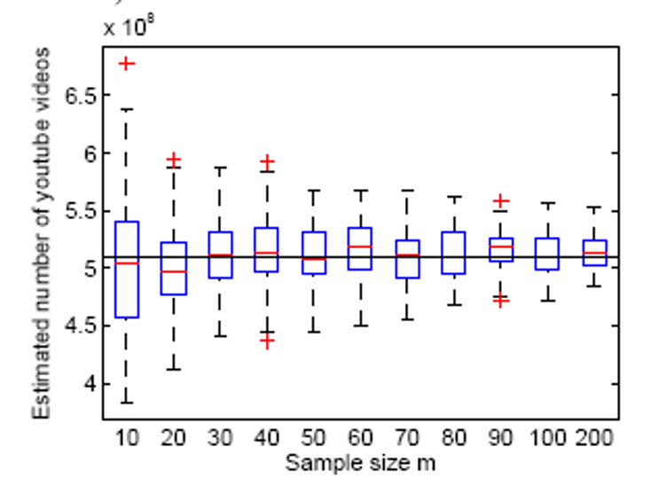
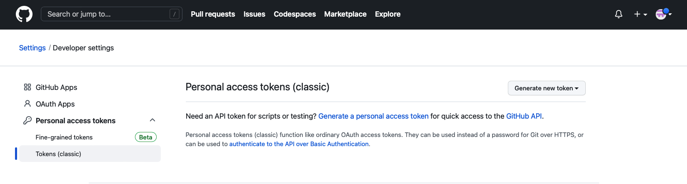

# Individual Project 1
# Estimating Online Site (Github) Statistics
#### Due Date
* Tuesday Feb 13, 2024 (23:59)

#### Total Points
* 100 (One Hundred)

## Goal
In this project, you will use Github APIs to download data and analyze the collected data. 

* Question to answer: Sample GitHub account IDs and estimate the total number of valid users in Github. In GitHub, user's ID is increasing from 1, but the ID will not be avaiable in GitHub API if the user deletes his/her account. In particular, 5% of the users' ID from 1 to 1000 were missing. Since the limits of GitHub API, you cannot download all the IDs and count the number of missing IDs, you need to sample some IDs and estimate the number of valid users with an unbiased estimator. This project will be completed in Python 3. 

## Deliverables & Grading
* PDF Report (70%) [template](https://www.acm.org/binaries/content/assets/publications/taps/acm_submission_template.docx)
	* proposal
	* methodology
	* empirical results and evaluation
	* conslusion
	
* Python Code (30%)

* Grading
  1. Code(30):
     1. Code for data crawling (20)
     2. Code for estimation (10)
  2. Report(70):
     1. Introduction & Proposal (10)
     2. Methodology (20):
     	a. Sampling/estimation method (10) 
	b. Proof of unbiasedness(5): The unbiasedness can be "proven" by the evaluation results, with figure similar to the one below (where the figure below was from the YouTube counting paper from lecture 2, Big data acquisition and measurement). The figure you want to show has the x-axis as different sampling budgets, and y-axis as the estimated total counts of active users in different runs. If you figure shows that there are half chances to over- vs under-estimate the total count, i.e., half chance to be above vs below the estimation average, it is a proof of unbiasedness. 
 	c. Correctness of proof (5): This correctness can be "proven" too by the figure above, if the figure shows that the averge estimates stay rounghly the same over different sampling budgets (values on the x-axis).  
     4. Evaluation & Results (30):
     	a. Results from a validation set (15): Valudation set is a set of active users you collected exhaustively in a manageable github ID range. For example, you can choose a small ID range to be 1 to 10,000, and exhaustively collect all active user IDs in it. Then within this validation set, you have the "ground truth" total number of active users. You can apply your sampling and estimation approach to this validation set, and see how acurate your estimater is comparing to the ground-truth.
	b. Results from the entire id space (15)
     5. Conclusion (10)

<p align="center">

</p>

## Project Guidelines

#### GitHub REST API
* [GitHub API documentation](https://developer.github.com/v3/)
* [Authentication](https://docs.github.com/en/authentication/keeping-your-account-and-data-secure/creating-a-personal-access-token) [Recommended using access token]
* [GitHub API users](https://developer.github.com/v3/users/)
* [GitHub API search](https://developer.github.com/v3/search/#search-users)


For API requests using Basic Authentication or OAuth, you can make up to 5000 requests per hour. You can create your personal access tokens under Settings ->Developer settings -> [Personal access tokens](https://github.com/settings/tokens). See this link [Managing your personal access tokens](https://docs.github.com/en/authentication/keeping-your-account-and-data-secure/creating-a-personal-access-token) for more details.

For this project, you can generate a new token (classic), and select **user** as the scope. Remember to copy the generated token and paste it in your code.

<p align="center">

</p>

#### Sample code

```python
import requests
import json

headers ={
      'Authorization': 'token <TOKEN>', # replace <TOKEN> with your token
    }
# collect data by users API
id_ = 0
response = requests.get('https://api.github.com/users?since='+str(id_),headers=headers)
data = response.json()

# collect data by search API
response = requests.get('https://api.github.com/search/users?q=created:<2023-12-27&created:>2023-12-25&sort=joined&order=desc',headers=headers)
data = response.json()
json_formatted_str = json.dumps(data, indent=2)
print(json_formatted_str)

# It will return 30 results for each request. You could consider using "for" loop to crawl more data.
# The sample code is a simple way to collect GitHub users' ID. You can consider other ways to collect data.
# The following is an example of data[0]
    {'login': 'mojombo',
     'id': 1,
     'node_id': 'MDQ6VXNlcjE=',
     'avatar_url': 'https://avatars0.githubusercontent.com/u/1?v=4',
     'gravatar_id': '',
     'url': 'https://api.github.com/users/mojombo',
     'html_url': 'https://github.com/mojombo',
     'followers_url': 'https://api.github.com/users/mojombo/followers',
     'following_url': 'https://api.github.com/users/mojombo/following{/other_user}',
     'gists_url': 'https://api.github.com/users/mojombo/gists{/gist_id}',
     'starred_url': 'https://api.github.com/users/mojombo/starred{/owner}{/repo}',
     'subscriptions_url': 'https://api.github.com/users/mojombo/subscriptions',
     'organizations_url': 'https://api.github.com/users/mojombo/orgs',
     'repos_url': 'https://api.github.com/users/mojombo/repos',
     'events_url': 'https://api.github.com/users/mojombo/events{/privacy}',
     'received_events_url': 'https://api.github.com/users/mojombo/received_events',
     'type': 'User',
     'site_admin': False}
     
#sample NUM ids since UID    
def sample(uid,num):
    ...
    return sample_data
    
#use downloaded data to build estimator  
def estimate(sample_data):
    ...
    return estimation
```
